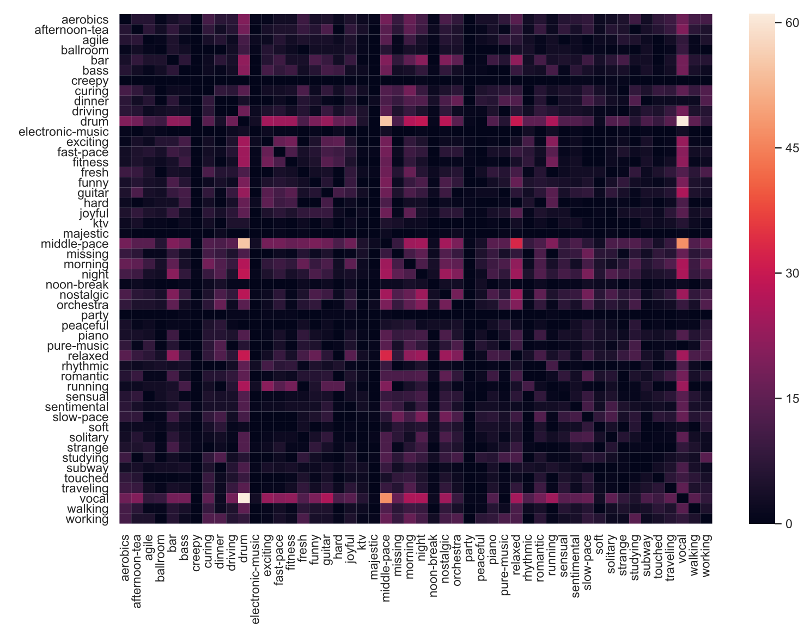

# DTME
The assets container for the paper DTME

## ECC tags

|      | Emotion                                                      | Characteristic                                               | Context                                                      |
| ---- | ------------------------------------------------------------ | ------------------------------------------------------------ | ------------------------------------------------------------ |
| Tags | agile, creepy, curing, exciting, fresh, hard, funny, joyful, majestic, missing, nostalgic, peaceful, relaxed, rhythmic, romantic, sensual, sentimental, soft, solitary, strange, touched. (Total 21) | bass, drum, electronic-music, fast-pace, guitar, middle-pace, orchestra, piano, pure-music, slow-pace, vocal.(Total 11) | aerobic, afternoon-tea, ballroom, bar, dinner, driving, fitness, ktv, morning, night, noon-break, party, running, studying, subway, traveling, walking, working (Total 18) |

### Co-occurrence matrix of tags

## Testing clip

The clip is in the [./assets/](https://github.com/kevinleeex/DTME/tree/master/assets) folder.

You can also [listen online](http://hexo-blog-1257698583.cos.ap-chengdu.myqcloud.com/1560332256921.wav).

